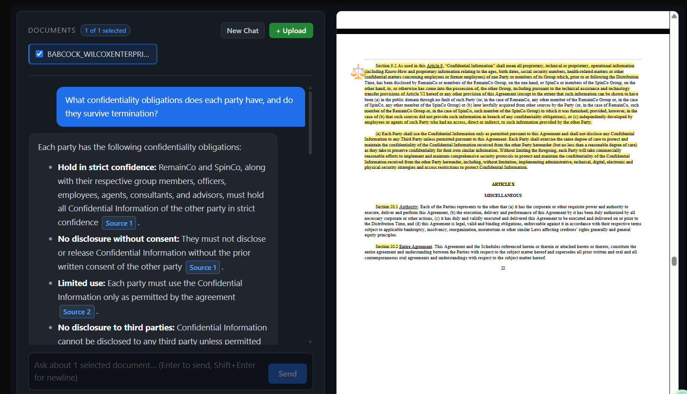
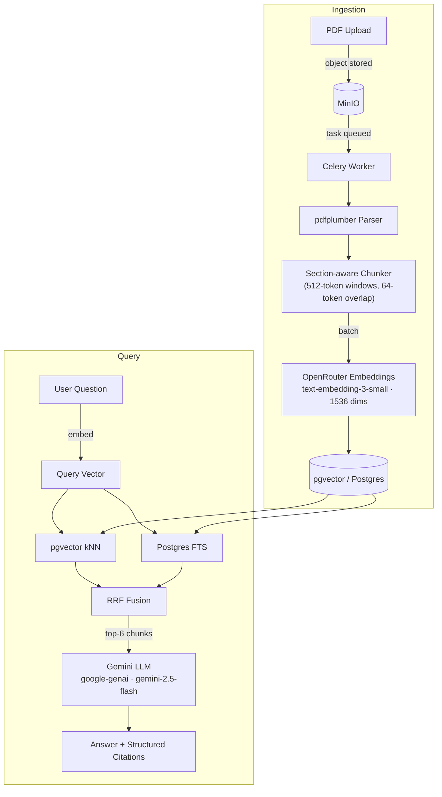

# legal-document-citation-rag

[](https://github.com/aniketqxp/legal-document-citation-rag/actions/workflows/ci.yml)

[](LICENSE)

Upload contract PDFs, ask questions in plain language, and receive answers where every factual claim is linked to the verbatim clause, page number, and section it came from. The system is multi-tenant: each user's documents, embeddings, and conversation history are isolated behind a `tenant_id` enforced at every CRUD and retrieval boundary.

<!-- Screenshot: docs/screenshots/workbench.png
     Add a screenshot of the workbench with a contract loaded on the left and
     a citation-linked chat answer on the right. -->


---

## Architecture

Two independent pipelines share a single Postgres instance:



---

## Stack

| Layer | Technology |
|---|---|
| API | FastAPI, SQLModel, SQLAlchemy asyncio, Alembic |
| Frontend | Vite, React, TypeScript, TanStack Router / Query |
| Database | PostgreSQL 16 + pgvector (1536-dim) |
| Object storage | MinIO (S3-compatible) |
| Background jobs | Celery 5 + Redis |
| Embeddings | OpenRouter → `openai/text-embedding-3-small` |
| LLM | Google Gemini `gemini-2.5-flash` via `google-genai` |
| Eval & experiment tracking | CUAD v1 benchmark, deterministic Hit@k / MRR, MLflow |
| CI | GitHub Actions — ruff lint + pytest on every push |

---

## Quick Start

**Prerequisites:** Docker, Node 18+, an [OpenRouter](https://openrouter.ai) API key, a [Gemini API](https://aistudio.google.com) key.

```bash
git clone https://github.com/aniketqxp/legal-document-citation-rag.git
cd legal-document-citation-rag

# 1. Configure environment
cp .env.example .env
# Set OPENROUTER_API_KEY, GEMINI_API_KEY, POSTGRES_PASSWORD,
# SECRET_KEY, MINIO_SECRET_KEY, FIRST_SUPERUSER_PASSWORD

# 2. Start backend services (Postgres, Redis, MinIO, FastAPI, Celery)
docker compose up -d

# 3. Seed the database and configure MinIO
docker compose exec backend python -m app.initial_data

# 4. Start the frontend dev server
cd frontend && npm install && npm run dev
```

Open `http://localhost:5173`.

---

## Retrieval Eval

A deterministic eval harness benchmarks the hybrid retrieval pipeline against
[CUAD v1](https://www.atticusprojectai.org/cuad) gold spans. No judge-LLM —
Hit@k and MRR are scored by matching lawyer-annotated clause spans against
retrieved chunk content.

**One-time setup** (separate venv; Docker stack must be running):

```bash
cd backend
python -m venv .venv-eval

# Windows
.venv-eval\Scripts\Activate.ps1
# Linux / macOS
# source .venv-eval/bin/activate

pip install -r evaluation/requirements-eval.txt
```

**Run the three-step pipeline:**

```bash
# Build the eval set from CUAD master_clauses.csv (one-time)
python -m evaluation.dataset

# Index CUAD contracts under an isolated eval tenant (re-run after chunker changes)
python -m evaluation.corpus

# Score retrieval and log results to MLflow
python -m evaluation.run_eval --run-name baseline
```

**Inspect results:**

```bash
mlflow ui --backend-store-uri file:///absolute/path/to/mlruns
# open http://localhost:5000
```

Changing a retrieval parameter (e.g. `MAX_CHUNK_TOKENS` in
`backend/app/services/chunker.py`) and re-running `corpus` + `run_eval`
produces a new MLflow run for side-by-side comparison.

---

## Environment Variables

| Variable | Required | Default | Notes |
|---|---|---|---|
| `OPENROUTER_API_KEY` | ✓ | — | Embeddings via OpenRouter |
| `GEMINI_API_KEY` | ✓ | — | Chat completions via Gemini |
| `POSTGRES_PASSWORD` | ✓ | — | |
| `SECRET_KEY` | ✓ | auto | JWT signing key — auto-generated value changes on restart; set explicitly to persist sessions |
| `MINIO_SECRET_KEY` | ✓ | — | MinIO admin secret |
| `FIRST_SUPERUSER_PASSWORD` | ✓ | — | Initial admin account |
| `OPENROUTER_BASE_URL` | | `https://openrouter.ai/api/v1` | |
| `EMBEDDING_MODEL` | | `openai/text-embedding-3-small` | Must match the pgvector column dimension |
| `QUERY_LLM_MODEL` | | `gemini-2.5-flash` | |
| `VITE_API_URL` | | `http://localhost:8000/api/v1` | Frontend API base URL |

---

## Notes

- `CUAD_v1/` and `reference_materials/` are local inputs — gitignored and never committed.
- Uploaded PDFs are stored in MinIO, not the repository.
- The PDF parser handles selectable-text contracts. Scanned PDFs return a clear error rather than being silently misindexed.
- The CI jobs (ruff + pytest) are hermetic — no database or API keys required. The live eval (`run_eval.py`) runs on demand.
